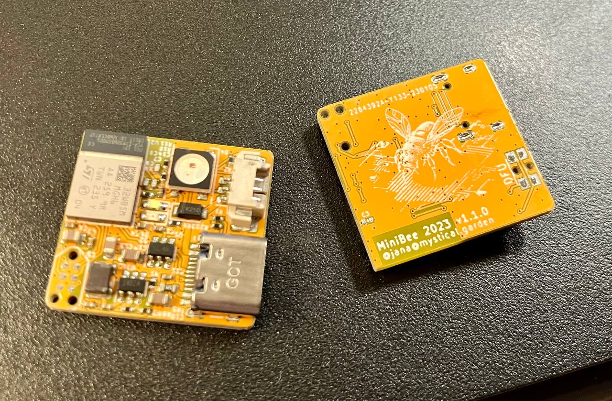

# MiniBee

STM32WB5 based Zigbee (and other RF protocols) to adressable LED (e.g. WS2812, SK6812) bridge with a footprint of just 22*23.5mm and USB.

<table>
  <tbody>
    <tr>
      <td>
        
      </td>
      <td>
        
      </td>
    </tr>
    <tr>
      <td colspan="2">
        
      </td>
    </tr>
  </tbody>
</table>
